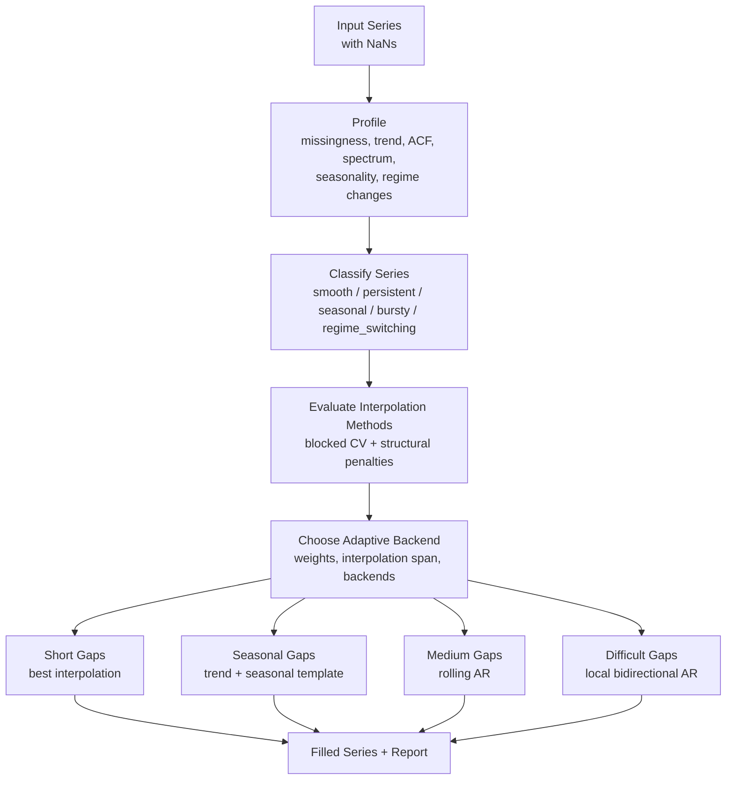
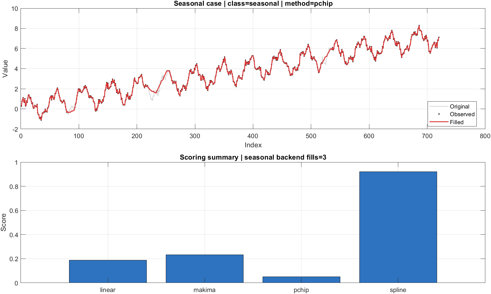
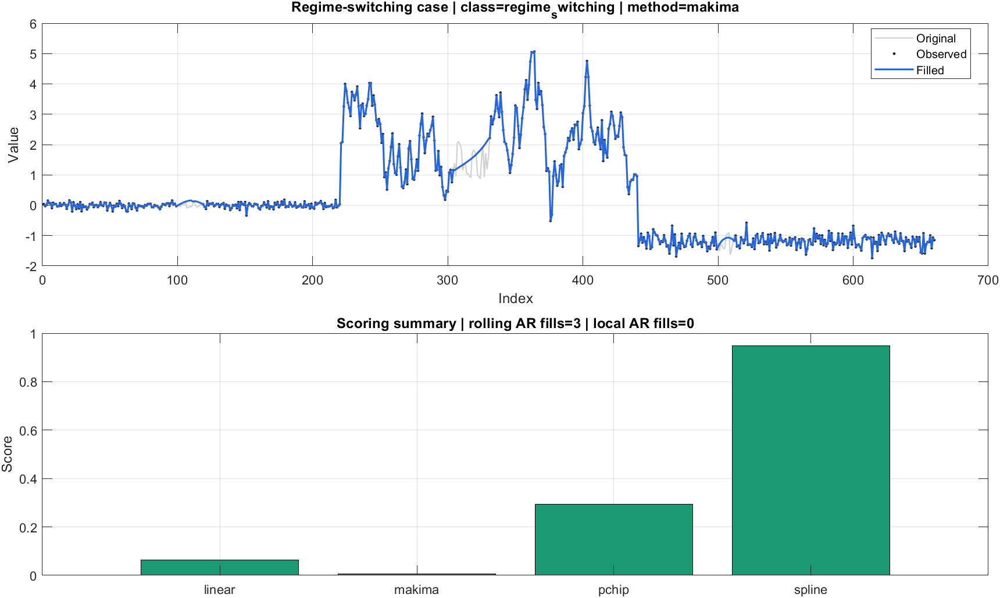
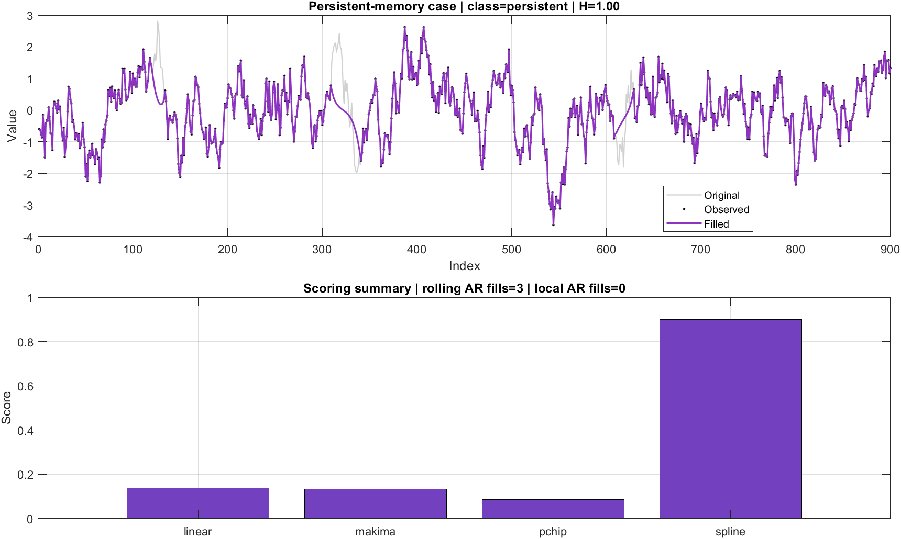

# gapfill-toolbox

MATLAB toolbox for exploratory analysis of missing-data patterns and automatic gap filling in time series.

`gapfill-toolbox` is aimed at transparent, structure-aware imputation rather than one-shot black-box filling. The library profiles the observed series, chooses a strategy based on structural diagnostics, and returns both the filled signal and a report explaining why a method was chosen.

Current scope:

- Profile missing-data structure and basic time-series diagnostics
- Estimate Hurst exponent with a DFA-based internal estimator
- Detect coarse series regimes: `smooth`, `persistent`, `antipersistent`, `seasonal`, `bursty`
- Detect regime changes and multiscale heterogeneity
- Score interpolation candidates with blocked cross-validation
- Penalize methods that distort spectrum, trend, or seasonal structure
- Fill short gaps with the best interpolation method
- Fill seasonal gaps with a trend + seasonal-template backend when appropriate
- Fill medium gaps with a deterministic rolling-AR backend
- Fill longer internal gaps with local autoregressive simulation
- Return a transparent report with metrics and chosen strategy

## Public API

- `gapfill.profile(data)`
- `gapfill.evaluate_methods(data)`
- `gapfill.auto_fill(data)`

## Repository Layout

- `src/+gapfill`: public API
- `src/+gapfill/+internal`: internal diagnostics, classification, and filling backends
- `examples`: runnable demos
- `tests`: smoke tests

## Pipeline Architecture



## Quick Start

```matlab
addpath("src");

x = cumsum(randn(1000, 1));
x(120:130) = NaN;
x(400:430) = NaN;

[xFilled, report] = gapfill.auto_fill(x);
disp(report.strategy)
```

## Visual Examples

### 1. Seasonal signal with medium gaps

The toolbox identifies the series as `seasonal`, keeps interpolation conservative, and enables the seasonal-template backend before falling back to AR-based fillers.



What happens here:

- the profiler detects strong periodic structure and a stable dominant period
- method ranking penalizes seasonal distortion, not only pointwise error
- the filling plan uses interpolation for short gaps and a seasonal template for larger internal gaps

### 2. Regime-switching signal with structural breaks

The toolbox identifies this as `regime_switching`, lowers the allowed interpolation span, and leans on local models instead of smoothing across transitions.



What happens here:

- the profiler detects heterogeneity across windows and change-like behavior
- the selector reduces aggressive interpolation across long gaps
- rolling/local AR backends preserve local dynamics better than a single smooth interpolant

### 3. Persistent-memory signal with Hurst exponent above 0.5

The toolbox now estimates H explicitly with a simple DFA-based routine. When `H > 0.5`, persistence contributes directly to the class decision and increases the weight of correlation and spectral preservation.



What happens here:

- the profiler estimates an effective Hurst exponent above `0.5`
- persistence is treated as evidence of long-memory behavior, not just high lag-1 correlation
- the selector becomes more conservative with interpolation and gives more weight to spectral/ACF preservation

## What The Automatic Analysis Does

`gapfill.auto_fill` runs a staged analysis before filling anything:

1. Profiles the observed part of the series.
   It measures missing-data geometry, trend strength, persistence, Hurst exponent, seasonality, spectral shape, burstiness, and regime-change indicators.
2. Classifies the series.
   The current coarse labels are `smooth`, `persistent`, `antipersistent`, `seasonal`, `bursty`, and `regime_switching`.
3. Benchmarks interpolation candidates.
   It hides observed blocks on purpose, reconstructs them, and scores each method using pointwise error plus penalties for structure distortion.
4. Builds an adaptive filling plan.
   The chosen class modifies interpolation span, metric weights, and which backends are enabled.
5. Fills by layers.
   Short gaps are interpolated first, then seasonal gaps, then rolling AR, and finally local AR for harder residual gaps.

## Design Notes

This first version is intentionally conservative:

- Interpolation is used only up to a selected gap length threshold
- Local AR filling is used only for internal gaps with enough context
- Very large or poorly supported gaps can remain unresolved unless a final fallback is requested

The goal is to keep the library inspectable and statistically defensible before expanding to more aggressive models.

The method selector is now adaptive:

- `smooth`: favors shape-preserving interpolation and larger interpolation spans
- `persistent`: emphasizes autocorrelation, Hurst-aware memory, and spectral preservation
- `antipersistent`: is stricter with long interpolation spans and favors more local reconstruction
- `seasonal`: emphasizes seasonal consistency and trend preservation
- `bursty`: is more conservative with long interpolation spans
- `regime_switching`: reduces aggressive interpolation and leans more on local adaptive models

## Examples

Basic demo:

```matlab
run("examples/demo_gapfill.m")
```

Comparative example with seasonal and regime-switching cases:

```matlab
run("examples/compare_strategies.m")
```

Generate the README images again:

```matlab
run("examples/render_readme_figures.m")
```

## Smoke Test

```matlab
run("tests/run_smoke_tests.m")
```

## Output Contract

`gapfill.auto_fill` returns:

- `xFilled`: filled series
- `report.profile`: exploratory diagnostics
- `report.evaluation`: method comparison table
- `report.strategy`: selected class, interpolation policy, and enabled backends
- `report.seasonal`, `report.rolling_ar`, `report.ar`: backend-level fill summaries

## Current Limitations

- The classifier is heuristic, not probabilistic.
- The seasonal backend assumes approximately stable periodicity.
- The AR backends are local and univariate; they do not use exogenous covariates.
- Extremely long edge gaps still require care or stronger domain assumptions.
